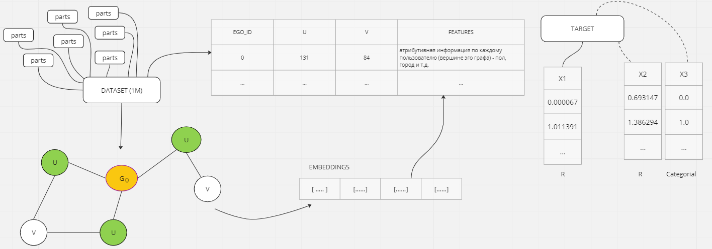
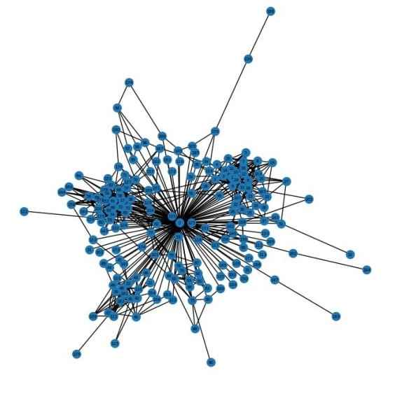
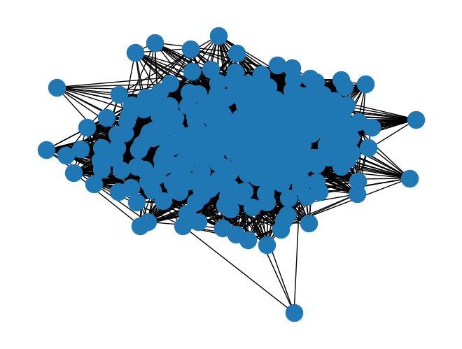
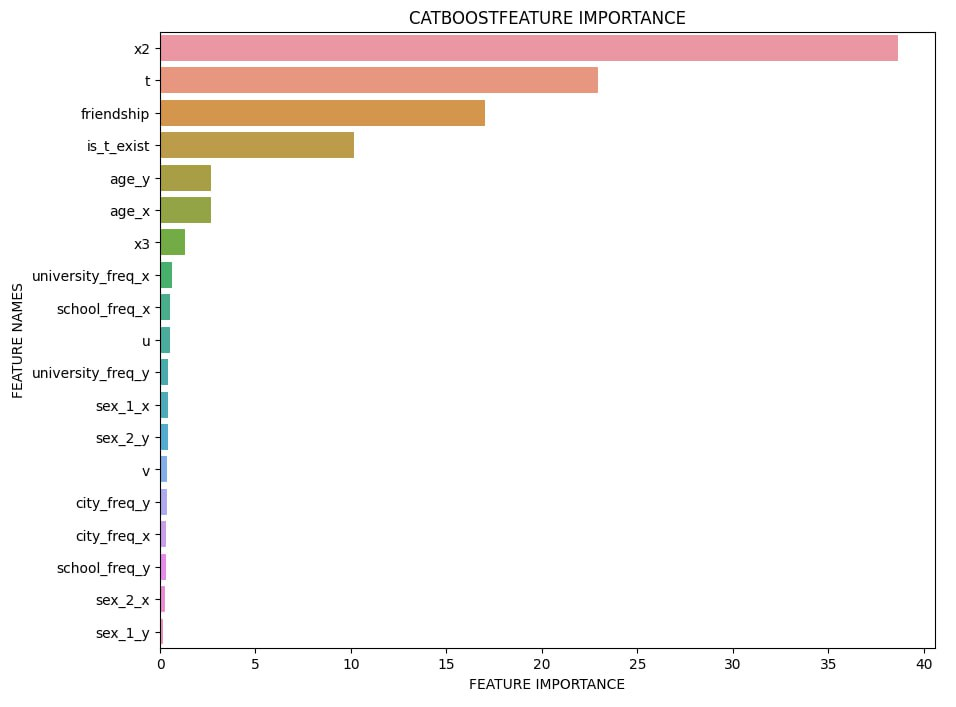
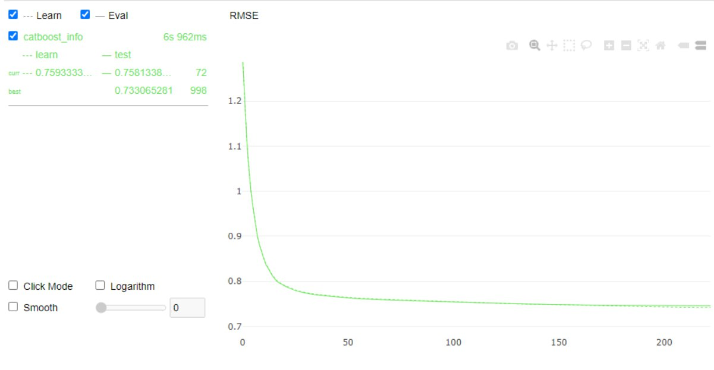
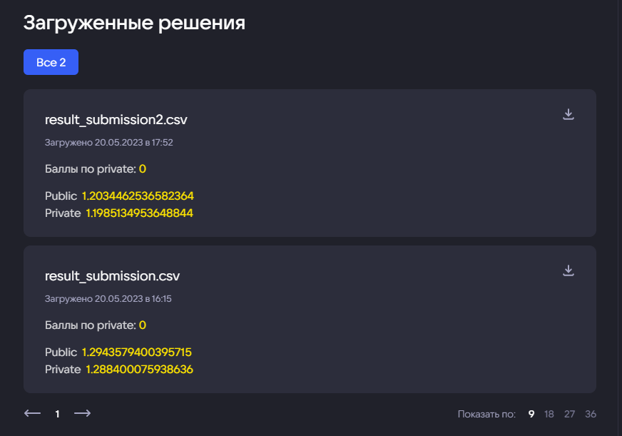
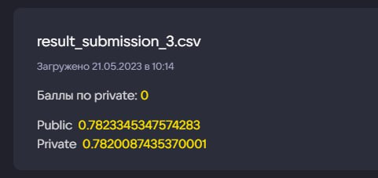

  

    
      
  

  <h1 align="center"> Предсказание интенсивности взаимодействия между друзьями в социальной сети ВКонтакте</h1>

  

    
    
    
    
    
    
    
  

  <h3>Краткое описание задачи:</h3>
  
Участникам хакатона предлагается предсказать интенсивность взаимодействия между пользователями, основываясь на информации об интенсивности других связей и пользовательской информации.

  <h3>Подход</h3>
  
Проведен разведывательный анализ данных (EDA) по признакам эго графов каждого пользователя и дополнительной атрибутивной информации, характеризующей как граф пользователя, так и вершины в его графовом пространстве.

  
Комбинации вершин u и v - характеризуют разнонаправленные ребра внутри неориентированного эго графа, при этом заметили корреляцию между признаками х1 и х2 и предположили, что каждый из этих признаков характеризует 
    интенсивность взаимодействия вершин графа u и v в разных направлениях.

  
<b><i>Информация подаваемая на вход модели:</i></b>

  
  
По атрибутам добавили новых признаков по частоте встречаемости городов, названий университетов и остальных признаков. Задачу решили свести к регрессии, т.е. формирование таблицы с признаками (свойства графа, вершин и ребер), 
    а в качестве целевого таргета выбрана переменная X1

  
  <h3>EDA</h3>

Визуализация эго графа пользователя (ego_id = 8)

  

Визуализация эго графа пользователя (ego_id = 120)

График важных признаков

  <h3>Модели</h3>
  
В качестве модели применяется CatBoost

  

  
  

    
    <ul>
      <li>Бустинговые модели как правило быстрее и лучше работают с табличными данными</li>
      <li>Прост в развертывании и использовании в отличие от нейронных сетей</li>
      <li>Использует небрежные деревья решений, чтобы вырастить сбалансированное дерево</li>
      <li>Позволяет получить неплохие результаты с параметрами по умолчанию, что сокращает время, необходимое для настройки гиперпараметров</li>
    </ul>
  

  
  <h3>Результаты</h3>
  
По графику функции потерь RMSE видно что модель неплохо обучается и может давать предсказания с низкой погрешностью. За счет настройки гиперпараметров удалось снизить ошибку модели RMSE с 1,2 до 0,78

 

Выгрузка submitions и тестирование в системе

  
  <h3>Что можно улучшить?</h3>
  

    <ul>
      <li>Добавить графовые модели для формирования эмбеддинга графа, реализованные с учетом методов Deep Walk по случайным блужданиям</li>
      <li>Обрабатывать данные с помощью pyspark, чтобы захватить полный объем датасетов</li>
      <li>Применить фич инжиниринг, для формирования новых признаков</li>
      <li>Реализовать ансамбль моделей</li>
    </ul>
  

Miro решения: https://miro.com/app/board/uXjVMJQAtKM=/ 
